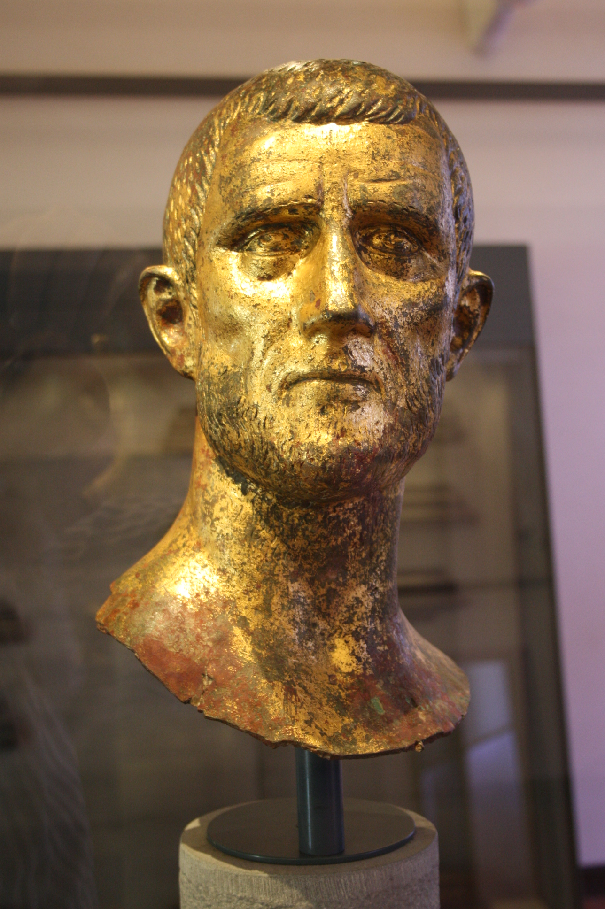

# Illyrian Guacamole Recipe

A historical take on guacamole inspired by ancient Illyrian cuisine, favored by Emperor Aurelian.

## Contents

- **Recipe**: Traditional Illyrian guacamole preparation methods
- **History**: Pre-Columbian ingredients and techniques, you don't need avocado eventually.
- **Poetry**: Verse celebrating Kalamata olive oil

## Getting Started

Explore the recipes and cultural notes in this collection to discover this unique culinary heritage.